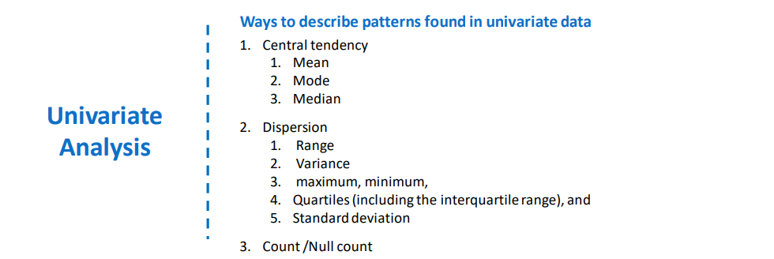

# Linear Regression
 
Linear regression is a linear approach to modelling the relationship between a dependent variable and one or more 
independent variables.
 

 

__The Problem on which we are going to work is House_price_prediction Dataset__  

* one dataset.
* Two outcomes
  1. Predict House price.
  2. Impact of different variables on house price.

Here are a few important questions that we might seek to address:
1. __Prediction Question__ : How accurately can I predict the price of a house, given thye values of all variables.
2. __Inferential Question__ : How accurately can we estimate the effect of each of this variables on the house price.

### Marketing Problem
1. Effect of Price change on revenue.
2. Impact of Advertising Budget on revenue.
3. Importance of product placement in the store on the number of unit sold.
 

### Key Terminology
1. Depend/ Responce variable-Variable we want to predict.
2. Independent/predictor Variables-Variables used for prediction.
3. Linear regression-Assume a linear relationship between dependent and independent variable.
4. Equation =y =a0+a1x1+a2x2+.....+an xn

 

#### Our Aim : To find Relationship between these variables

## Next steps 
 

 

### Handling Missing data 
 

 

 

### Outlier Treatment
 

 

### After Cleaning data , it is time to perform Univariate Analysis

Univariate analysis is the simplest form of analyzing data. “Uni” means “one”, so in other words your data has only one 
variable. It doesn’t deal with causes or relationships (unlike regression) and it’s major purpose is to describe; it takes 
data, summarizes that data and finds patterns in the data.

__Steps__
 

 

### Dummy Variable
A Dummy variable or Indicator Variable is an artificial variable created to represent an attribute with two or 
more distinct categories/levels.

 

 

### Correlation
Correlation is a statistical measure that indicates the extent to which two or more variables fluctuate together. A 
positive correlation indicates the extent to which those variables increase or decrease in parallel; a negative correlation 
indicates the extent to which one variable increases as the other decreases.
__Example of high correlation__
* Your caloric intake and your weight.
__Example of low correlation__
* A dog's name and the type of dog biscuit they prefer.

### Correlation Coefficient

 

### Causation
Causation : The relation between something that happens and the thing that causes it . The first thing that happens is 
the cause and the second thing is the effect . 

You can see my Excel sheet. All  the work is explained in detail.

### AUTHOR

<strong>Shehryar Gondal</strong>

You can get in touch with me on my LinkedIn Profile: 
 

You can also follow my GitHub Profile to stay updated about my latest projects: 

If you liked the repo then kindly support it by giving it a star ⭐.